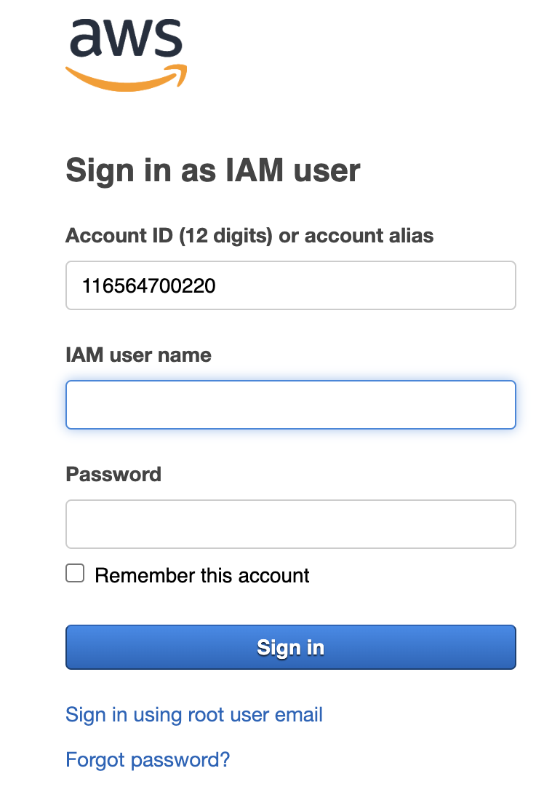
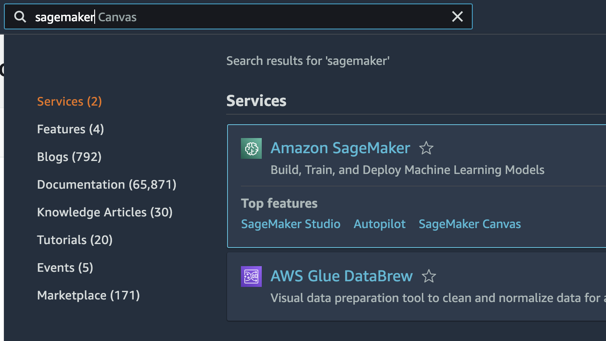
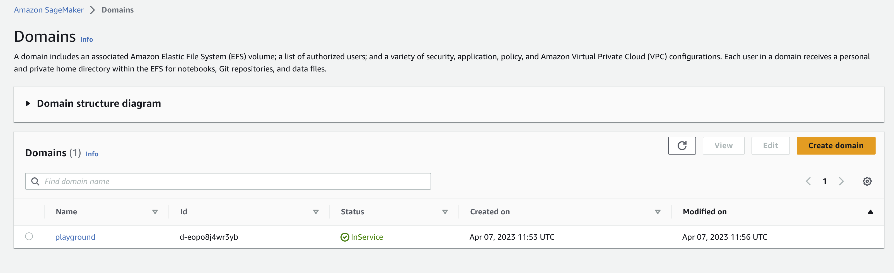
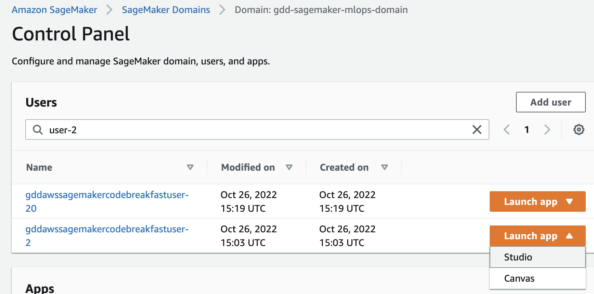
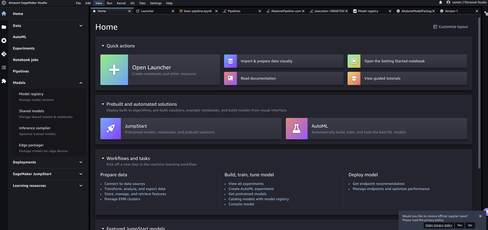
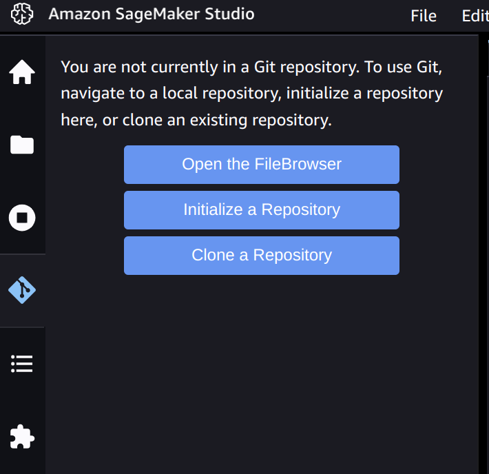
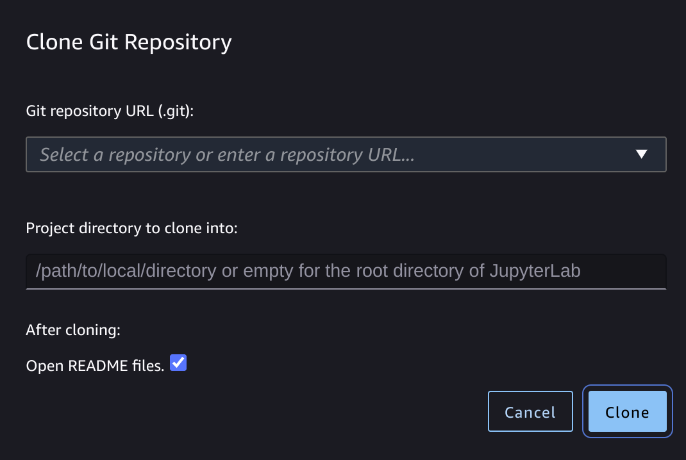
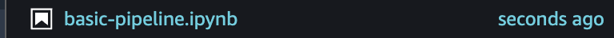
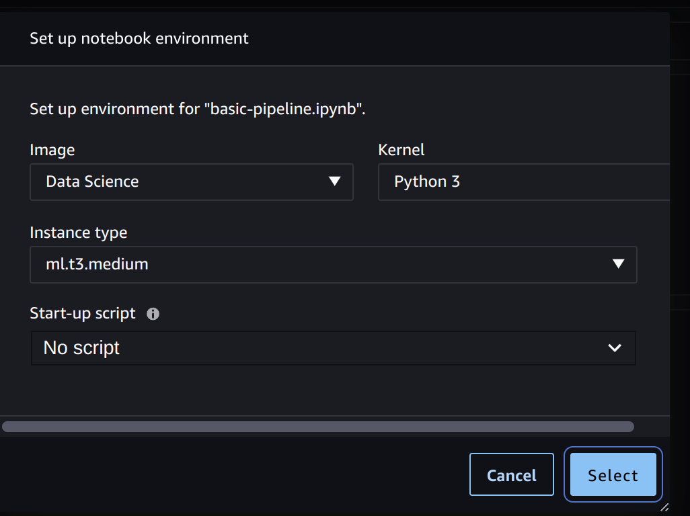
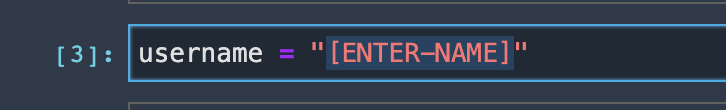

# uva-ads-tech-2023-workshop
Repository for the AWS MLOps Workshop using SageMaker on 13th April 2023.


## Setup

Hi! Let's get you logged into the SageMaker Studio environment and start building pipelines.

1. Open up the AWS console:

    [https://116564700220.signin.aws.amazon.com/console](https://116564700220.signin.aws.amazon.com/console)

2. Login with your credentials:

    

3. Open up SageMaker in the AWS console:

    

4. Switch your region to **Ireland**.

5. Go to SageMaker **Domains** and click on the **playground** domain.

    

6. Find the user which corresponds to your login i.e. **user-2**.

    

    Then click Launch -> Studio. Give Sagemaker Studio a bit of time to launch:

    You should eventually see the Studio landing page:

    

7. On the left-hand side, go to Git:

    

    And then click **Clone a Repository**:
    
    

    Enter the following Git URL:

    ```
    https://github.com/godatadriven/uva-ads-tech-2023-workshop
    ```

8. Open up the `basic-pipeline.ipynb`:

    

9. Select the following for the environment on which the notebook will run:
    


10. Lastly, make sure to modify the username:

    


Good luck! 🍀

## About
Created by Usman Zafar and Jetze Schuurmans, working for Xebia Data (formerly GoDataDriven).